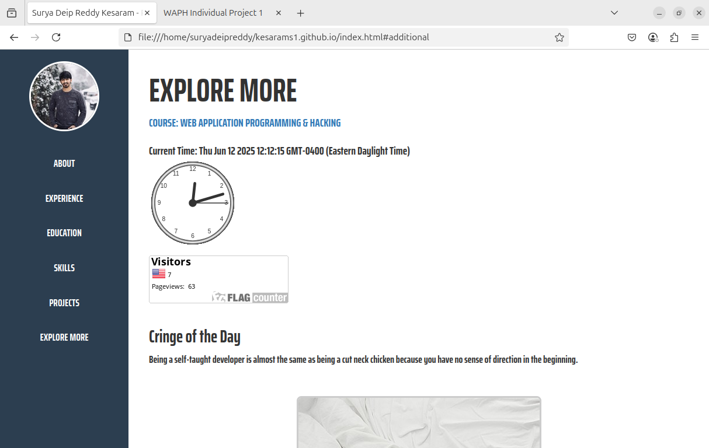
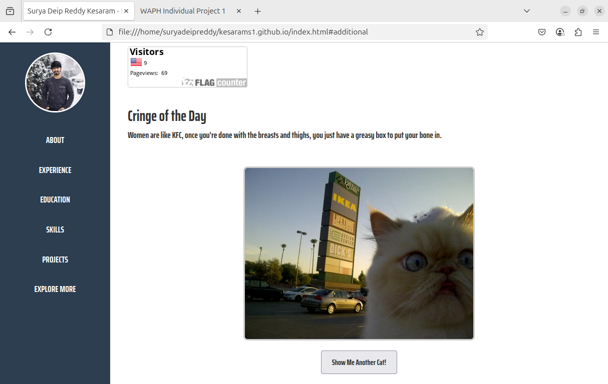

# WAPH-Web Application Programming and Hacking

## Instructor: Dr. Phu Phung

## Student

**Name**: Surya Deip Reddy Kesaram

**Email**: [mailto:kesarams1@udayton.edu](kesarams1@udayton.edu)


## Repository Information

Respository's URL: [https://github.com/kesarams1/waph-suryadeipreddy.git](https://github.com/kesarams1/waph-suryadeipreddy.git)

This is a private repository for Surya Deip Reddy Kesaram to store all content for the course. The organization of this repository is as follows.

Latest update: June 12, 2025

# Individual Project 1
## Front-end Web Development with a Professional Profile Website and API Integration on github.io Cloud Servicech

## Project Overview 

This project focuses on enhancing front-end web development skills by building a fully responsive professional portfolio and hosting it on GitHub Pages. It integrates various web technologies including HTML, CSS (Bootstrap), JavaScript, jQuery, third-party APIs, and cookies to create a dynamic, interactive experience. 

Through this project, I gained hands-on experience in DOM manipulation, responsive design, asynchronous API integration, cookie management, and cloud deployment.

---

## General Requirements

I created a professional personal website hosted on GitHub Pages under the domain: [https://kesarams1.github.io](https://kesarams1.github.io) and cloned it to my virtual machine.

The main sections of the `index.html` site include:
- About Me
- Experience
- Education
- Skills
- Projects
- Explore More


I used a custom Bootstrap-based template with personalized styling and fonts (Google Fonts: Saira Extra Condensed and Muli) to maintain a modern and professional layout.

Additionally, I created a separate page `waph.html` introducing the WAPH course and more hands-on tasks, linked in “Explore More” section -> [https://kesarams1.github.io/waph.html](https://kesarams1.github.io/waph.html)


```html
    <section id="additional" class="section">
      <h2 style="font-size: 55px;">EXPLORE MORE</h2>
      <a 
        href="https://kesarams1.github.io/waph.html" 
        target="_blank";
        style="font-size: 20px;">
        COURSE: WEB APPLICATION PROGRAMMING &amp; HACKING
      </a>
```
---

## Non-technical Requirements

### CSS Framework
I used **Bootstrap 3.4.1** via CDN, along with custom Google Fonts and additional style to modify for a cleaner layout and sidebar-based navigation.
```html
  <meta name="viewport" content="width=device-width, initial-scale=1">
  <link rel="stylesheet" href="https://maxcdn.bootstrapcdn.com/bootstrap/3.4.1/css/bootstrap.min.css">
  <script src="https://ajax.googleapis.com/ajax/libs/jquery/3.5.1/jquery.min.js"></script>
  <script src="https://maxcdn.bootstrapcdn.com/bootstrap/3.4.1/js/bootstrap.min.js"></script>

  <!-- Google fonts-->
  <link href="https://fonts.googleapis.com/css?family=Saira+Extra+Condensed:500,700" rel="stylesheet" type="text/css" />
  <link href="https://fonts.googleapis.com/css?family=Muli:400,400i,800,800i" rel="stylesheet" type="text/css" />
```
Also to mention I've used the autoscaling for responsive website when various resolution devices using the website! 


### Page Tracker
I integrated **FlagCounter** to track page visits and view counts by country:



```html
      <!-- Flag Counter Widget -->
      <div style="text-align: left; margin-top: 10px;">
        <a href="https://info.flagcounter.com/atJN" target="_blank" rel="noopener noreferrer">
          
        </a>
      </div>
```

---

## Technical Requirements

### Basic JavaScript Code

- Digital Clock: A live digital clock is embedded into the `index.html` implemented using setInterval() and Date() functions, As the digital clock was linked to the "Explore More" section.

```html
    <!-- Digital Clock -->
    <div id="digit-clock"; style="font-size: 20px;" ></div>
    <script>
      function displayTime(){
        document.getElementById('digit-clock').innerHTML = "Current Time: " + new Date();
      }
      setInterval(displayTime, 500);
    </script>
```

- Analog Clock: The analog clock uses a <canvas> element and an external JS library (clock.js) provided in the course to provide a ticking analog clock. As the Analog clock was linked to the "Explore More" section.

```html
    <!-- Analog Clock -->
    <canvas id="analog-clock" width="150" height="150"></canvas>
    <script src="https://waph-phung.github.io/clock.js"></script>

    <!-- Inline JavaScript to draw the clock -->
    <script>
        var canvas = document.getElementById("analog-clock");
        var ctx = canvas.getContext("2d");
        var radius = canvas.height / 2;
        ctx.translate(radius, radius);
        radius = radius * 0.90;
        setInterval(drawClock, 1000);

        function drawClock() {
          drawFace(ctx, radius);
          drawNumbers(ctx, radius);
          drawTime(ctx, radius);
        }
    </script>
```


- Show/Hide Email: Toggling email visibility is done with a button click using JavaScript, which was included in the "About" section under contact information. And to match with the contact info text size, I've managed to set the exact same size for the email address too.


```html
    <!-- Show/Hide Email -->
    <script>
      var shown = false;
      function showhideEmail(){
        if (shown){
          document.getElementById('email').innerHTML = "Show my email";
          shown = false;
        } else {
          var myemail = "<a href='mailto:kesarams1" + "@" + "udayton.edu'>kesarams1" + "@" + "udayton.edu</a>";
          document.getElementById('email').innerHTML = myemail;
          shown = true;
        }
        document.getElementById('email').style.fontSize = '20px';
      }
    </script>
```

- Custom Functionality – Daily Quotes: I used the API Ninjas Quotes API to fetch motivational quotes every minute and display them dynamically. Which was included in the "About" section after contact information.


```html
    <!-- Quotes refresh 1 minute -->
    <script>
      (function() {
        const quoteEl = document.getElementById('quote');
        const authorEl = document.getElementById('author');

        async function updateQuote() {
          try {
            const res = await fetch('https://api.api-ninjas.com/v1/quotes', {
              headers: { 
                'X-Api-Key': 'xxxxxxxxxxxxxx' 
              }
            });
            if (!res.ok) throw new Error('HTTP ' + res.status);
            const [item] = await res.json();
            quoteEl.textContent  = `"${item.quote}"`;
            authorEl.textContent = '— ' + item.author;
          } catch (err) {
            console.error('Quote error:', err);
            quoteEl.textContent  = 'Failed to load quote.';
            authorEl.textContent = '';
          }
        }

        // Initial fetch on page load, then every 60 000 ms
        document.addEventListener('DOMContentLoaded', updateQuote);
        setInterval(updateQuote, 60000);
      })();
    </script>
```
---
#### Web API Integration

1. Joke API: I used the public JokeAPI (https://v2.jokeapi.dev/joke/Any) to fetch and refresh cringe jokes every minute or everytime refreshing the page:


```javascript
setInterval(retrieveAndShowJoke, 60000);
```

2. Graphics API – Cat Images: To add fun and visual interest, I integrated The Cat API (https://api.thecatapi.com/v1/images/search) that shows a random cat image with a “Show Me Another Cat!” button.




```html
    <script>
      (function() {
        const imgEl = document.getElementById('cat-img');
        const btnEl = document.getElementById('new-cat-btn');

        // Fetch and display a random cat image
        async function loadRandomCat() {
          try {
            const res = await fetch('https://api.thecatapi.com/v1/images/search');
            if (!res.ok) throw new Error(`Fetch error: ${res.status}`);
            const [data] = await res.json();
            imgEl.src = data.url;
          } catch (err) {
            console.error('Could not load cat:', err);
            imgEl.alt = 'Failed to load a cat :(';
          }
        }
        // Initial load when DOM is ready
        document.addEventListener('DOMContentLoaded', loadRandomCat);

        // Load a new cat on button click
        btnEl.addEventListener('click', loadRandomCat);
      })();
    </script>
```

---

- Cookie Handling – User Visit Tracker
Cookies are set to record and check the user's last visit. Depending on whether the user is new or returning, a custom message is shown via alert():

```JavaScript
if (!info) {
  msg = 'Welcome to my homepage for the first time!';
} else {
  msg = `Welcome back! Your last visit was ${info.lastVisit}`;
}
```


Cookie is updated with each new visit using:

```JavaScript
document.cookie = `visitInfo=${payload}; path=/; max-age=31536000`;
```


---

## Submission

`suryadeipreddy-waph-project1.pdf`